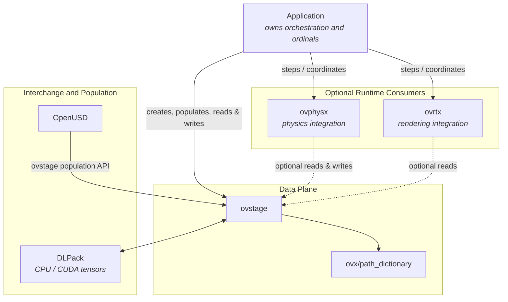
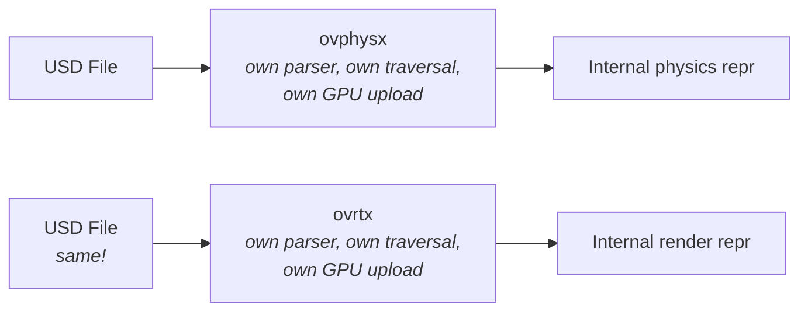
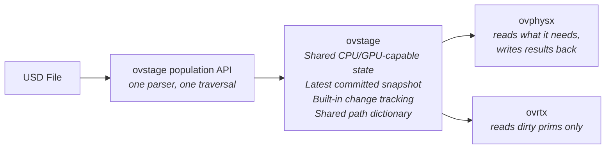

# ovstage — Overview

---

## Executive Summary

**ovstage** is a high-performance, in-process runtime data store for USD scene data. It holds post-composition scene state (transforms, velocities, materials, hierarchy, metadata) in a vectorized, CPU/GPU-capable format and provides a unified C API for reading, writing, and querying that data.

The core value proposition: **ovstage replaces the pattern where every library (physics, rendering, sensors) independently parses USD and maintains its own copy of common scene state.** Instead, participating libraries can share a single runtime stage with explicit change tracking, CPU/GPU tensor interchange, and change membership — reducing redundant parsing and memory usage while enabling zero-copy data paths between producers and consumers running at different rates.

---

## Why ovstage Exists

### The problem without ovstage

Each library needs access to USD scene data at runtime:

- **ovphysx** needs transforms, collision meshes, joint states, material properties
- **ovrtx** needs meshes, lights, cameras, materials, transforms
- **Sensor consumers** need sensor configurations, scene geometry, transforms

Without a shared data layer, each library must:

1. **Parse USD independently** — duplicate work, duplicate code, divergent implementations
2. **Maintain its own internal scene representation** — N copies of the same data in memory
3. **Implement its own change detection** — each library re-invents dirty tracking
4. **Handle its own GPU residency** — each library manages CPU→GPU transfers independently
5. **Define its own prim addressing** — no shared handles, requiring string-based lookups at every boundary

This creates O(N) cost growth with each new library, inconsistent behavior across libraries, and no standard way for an application to know "what changed since last frame" across the full scene.

### What ovstage provides

ovstage is a building block — the application is always in control of what data flows through it, when, and between which libraries. OV libraries provide out-of-the-box usage patterns (e.g. ovphysx writes simulated transforms into ovstage, ovrtx reads them and renders), but these patterns are extensible and composable by the application.

Core capabilities:

- **Ordinal-keyed writes** — every write carries an ordinal used purely for ordering and change membership; payload reads always return the latest committed snapshot (no historical or per-version payload access)
- **CPU/GPU tensor interchange** — DLTensor carries CPU or CUDA buffers without requiring a custom tensor format. The current 0.1 backend accepts zero-copy CUDA source tensors for writes, while payload reads and map/unmap buffers are CPU-resident; GPU array reads and CUDA array maps are not yet supported.
- **Built-in change detection** — change-membership queries ("what changed since ordinal N?") are a first-class operation (expressed as an ordinal-range read; see `ovstage_ordinal_range_t` in the C API reference) that report exact changed prims within the runtime-reported retention frontier; callers do not assume a fixed retention depth, and older markers may be coalesced per attribute and prim
- **Uniform addressing** — shared prim path dictionary means handles pass between libraries with zero conversion
- **Asynchronous submission** — state-mutating and data-producing work is enqueued, while fetch, status, lifecycle, and path-dictionary calls remain synchronous. The current 0.1 backend executes queued work serially; the API preserves ordinal ordering semantics for future concurrent backends.
- **Query filters** — queries filter on prim metadata (type, schema, path)

---

## Design Principles

These principles guided the API design and are relevant for understanding trade-offs:

1. **Simplicity and ergonomics first.** Unified addressing model — every operation uses the same (prim set + attribute + ordinal) pattern. Stale handles are reported with a clear error (`OVSTAGE_ERROR_INVALID_HANDLE`), not silent corruption.

2. **No leaked implementation details.** The API does not expose internal storage layout. Read results are grouped by memory locality (for performance), not by schema bucketing (an implementation choice). Consumers never need to understand internal partitioning.

3. **Zero-copy-capable tensor transport.** Read results return pointers into internal storage. DLTensor carries device type, pointer, and shape for CPU and GPU interchange without a custom tensor format. In the current 0.1 backend, reads and map/unmap buffers are CPU-resident; CUDA source tensors can be ingested without a host round-trip, while GPU array reads and CUDA array maps remain future work.

4. **Optional complexity — implementations can subset.** An implementation supporting only latest-value reads uses the same API signatures. Value-based query filters are optional. Historical/per-version payload access is optional. The API contract is the same; the capability level is declared.

5. **Round-trip symmetry.** Canonical read results are directly usable as write inputs — same addressing and data structures. Fixed-size values use one transported data-row dimension plus `dtype.lanes`; compact convenience write shapes are normalized to that canonical form. Logical prim-to-row association remains separate in `data.index_map`.

---

## Dependency Graph

The following diagram shows the current public data-plane relationships. Applications own and orchestrate ovstage. Runtime libraries such as ovphysx and ovrtx can integrate with that shared stage, but they are optional consumers rather than prerequisites for using ovstage.

### Key relationships

| Component | Relationship |
|---|---|
| **Application** | Owns the ovstage instance, ordinals, write-floor advancement, and consumer scheduling. |
| **ovphysx** | Optional integration consumer that can read scene setup and write simulation results through an application-owned ovstage. |
| **ovrtx** | Optional integration consumer that can read changed render state from an application-owned ovstage. |
| **ovx/path_dictionary** | Shared addressing API used by ovstage and participating consumers to exchange tokens and prim-path lists. |
| **OpenUSD** | Optional source of composed scene data through the `ovstage_population_*` API. Direct runtime authoring does not require loading USD. |
| **DLPack** | Tensor interchange format for CPU and CUDA producers and consumers, subject to the current backend limitations described above. |

This graph describes supported public integration boundaries, not a requirement that every OV library use ovstage. Additional library integrations should be documented when their public contracts and maturity are established.

---

## How ovstage Replaces Per-Library USD Access

### Before ovstage: each library owns its USD pipeline

**Problems:** Duplicate parsing and common scene state, divergent behavior, and no shared change tracking or addressing.

### With ovstage: single parse, shared runtime state

**Benefits:**
- **Parse once:** The ovstage population API traverses USD once. Participating libraries consume the same populated data.
- **Built-in change detection:** A consumer can ask "what changed since my last read?" and use change membership instead of performing a full-scene diff.
- **Different rates with explicit coordination:** Producers and consumers can run at different cadences while the application owns ordinals, write-floor advancement, retention checks, and consumer scheduling.
- **CPU/GPU interchange:** DLPack permits CPU or CUDA producers without a custom tensor format. In 0.1, CUDA source tensors can be written without a host round-trip, but reads and map/unmap buffers remain CPU-resident.
- **Shared addressing:** Participating libraries use the shared path dictionary so tokens and prim-path lists can cross integration boundaries without repeated string lookups.

---

## Consumer Update Model

ovstage stores data and exposes changes — but it does **not** automatically push updates to consumers. Each library owns when and how it reads from ovstage:

- **Pull-based:** Libraries call read operations when they're ready for new data (typically once per their simulation tick)
- **Delta-aware:** Reads can ask "what changed since ordinal N?" — ovstage reports only the changed prims and returns their latest data, not the full scene. Only the latest payload is retained, so a *fixed* range whose selected `(attribute, path)` changed again after the range end cannot be represented and returns `OVSTAGE_ERROR_OUT_OF_RANGE` rather than membership and data
- **Independent rates within retention:** A consumer can request a larger change range on its next read without imposing a global update cadence. Exact change membership is guaranteed only at or above the runtime-reported retention frontier; consumers must query that frontier and recover appropriately if they fall behind it. API waits and CPU/GPU synchronization still apply where documented.
- **No global sync:** A write by ovphysx does not trigger an immediate update in ovrtx. The renderer reads when it's ready for the next frame.

---

## Scope and Non-Goals

### In scope (current)

- Vectorized, CPU/GPU-capable data store for post-composition USD attributes
- Ordinal-keyed writes; payload reads return the latest committed snapshot
- Delta reads (change-membership stream: which prims changed since a given ordinal)
- Query filters
- Zero-copy CPU map/unmap into storage-owned buffers; zero-copy CUDA source-tensor ingest for writes
- Asynchronous submission with ordinal-keyed ordering; current backend execution is serialized
- Path dictionary for cross-library handle sharing
- USD population (mirroring composed stage into ovstage)
- Transform hierarchy propagation

### Not in scope

- Cross-process replication built into ovstage (applications own sync between instances)
- Full authoring workflows (ovstage is a runtime layer, not an authoring tool)

---

## Frequently Asked Questions

### Is ovstage a remote service?

No. ovstage is an **in-process runtime data layer**.

### How does ovstage relate to USD?

ovstage stores **post-composition** USD data in a runtime-optimized format. It does not replace USD for authoring, interchange, or storage. The relationship is:

- **USD** = persistent scene description (files, composition, layering)
- **ovstage population API** = the optional bridge that traverses composed USD and writes attributes into ovstage
- **ovstage** = runtime mirror (vectorized, CPU/GPU-capable, change-tracked, queryable)

Libraries read from ovstage at runtime; they don't need to interact with USD directly.

### How does change detection work?

Every write carries an ordinal used for ordering and change membership. Readers can ask "what changed since ordinal N?" and get back the set of changed prims; payload reads then return those prims' latest committed values — there is no historical or per-version payload access. This replaces the pattern of external dirty flags or full-scene diffing. Change detection is built into the data plane — not a separate mechanism.

### What data format does ovstage use?

All tensor data uses **DLTensor** (from the DLPack standard). This provides zero-copy interop with the Python/ML ecosystem (NumPy, PyTorch, JAX, Warp) and carries device type, pointer, shape, and lane-width metadata. No custom tensor types.

Fixed-size attributes use a lane-canonical raw layout: reads and maps return `ndim = 1`, `shape = (N,)`, with the complete per-row tuple width in `dtype.lanes`, where `N` is the transported data-row count. Without `data.index_map`, logical prims select rows one-to-one and `N` must equal the logical prim count; with it, `data.index_map[i]` selects the row for logical prim `i`, so `N` may differ from the logical prim count: it can be smaller when rows are shared, or larger when a query touches only part of a transported bucket. Copy-in writes may use compact convenience shapes such as `(N, 3)` with one lane for a point or `(N, 4, 4)` with one lane for a matrix, but those trailing dimensions are folded and are not preserved. A flat `(N * L,)` tensor with one lane is not a convenience encoding of `N` rows of width `L`. The corresponding raw results are `(N,)` with 3 or 16 lanes. Python DLPack export expands the lane width as exactly one trailing axis, so the matrix becomes `(N, 16)`, not `(N, 4, 4)`. Array/ragged attributes are outside this fixed-size rule.

### Can ovstage be used without the full Omniverse stack?

Yes. ovstage has no dependency on a host application framework or the Omniverse runtime. The distributed package bundles its runtime dependencies. Applications can author and access CPU-resident stage data without a CUDA-capable GPU; OpenUSD is used when the optional `ovstage_population_*` APIs load scene data, and CUDA support is needed only for GPU-resident data paths. The path-dictionary API is provided as part of the shared OVX headers.
