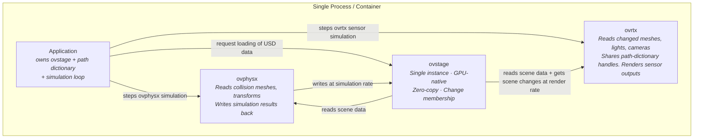
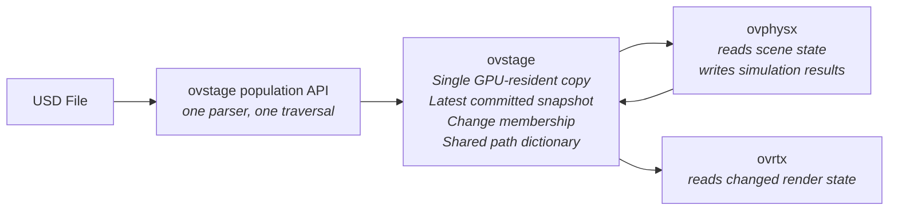

# NVIDIA ovstage

[](https://nvidia-omniverse.github.io/ovstage)
[](LICENSE)
[](https://github.com/NVIDIA-Omniverse/ovstage)
[](https://github.com/NVIDIA-Omniverse/ovstage/actions/workflows/docs.yml)

**ovstage** is a C and Python library providing a shared, high-performance, vectorized, GPU-capable scene data substrate for [USD](https://openusd.org) scene data for use in Omniverse Libraries spanning physics, rendering, sensors, animation, and more. 

It provides C and Python APIs for reading, writing, querying, and managing simulation data such as transforms, velocities, materials, hierarchy, and metadata across CPU and GPU memory, with zero-copy data paths and DLPack tensor interchange. Currently, zero-copy applies to CUDA source-tensor writes; payload reads and map/unmap buffers are CPU-resident.

**ovstage** is suited for developers looking to build simulation and visualization applications, tools or workflows based on Omniverse Libraries, such as [ovphysx](https://github.com/NVIDIA-Omniverse/PhysX/tree/main/ovphysx) and [ovrtx](https://github.com/NVIDIA-Omniverse/ovrtx).

No Omniverse background is needed to use ovstage. It is a standalone library that gives your application a fast, vectorized, in-memory representation of a scene to read and write from C or Python. You can author scene data directly, or load it from [OpenUSD](https://openusd.org). Omniverse Libraries such as [ovphysx](https://github.com/NVIDIA-Omniverse/PhysX/tree/main/ovphysx) and [ovrtx](https://github.com/NVIDIA-Omniverse/ovrtx) are consumers that build on the same substrate, not prerequisites.

> [!NOTE]
> ovstage is currently **pre-release** software. The API, runtime behavior, and packaging may change. Full API documentation is published at <https://nvidia-omniverse.github.io/ovstage> (see [Documentation](#documentation)).

To get started with ovstage follow the instructions below for the included Python and C/C++ examples. 
* [Get started in Python](#getting-started-in-python)
* [Get started in C/C++](#getting-started-in-cc)

Sources live under [`examples/`](examples/) and are the source of truth for the code snippets referenced by the ovstage skills — see the [examples index](examples/README.md).


## High-level Feature Set

* Population from USD: 
    * Support loading of [USD](https://aousd.org/) scene description to a vectorized runtime representation suitable for high performance simulation on CPU and GPU. Compatibility with OpenUSD allows interchange with a vast ecosystem of content creation, CAD and simulation tools. 
    * Load from file or from USDA text description in memory
    * Add references to other USD files or to USDA text description in memory
    * Apply changes from timesampled data in USD to the entire stage
* Efficient cloning of stage subtrees
* Stage hierarchy lookups
* Explicit queries for instanced data (prototype and instance roots)
* Easy integration with Python simulation and AI ecosystem.

## Packaging and Dependencies

ovstage is distributed as a C package (.zip file) available in the Releases page in this repo, and as Python wheels available via pypi.org.
These packages include a number of pre-packaged dependencies.

In addition to these pre-packaged dependencies, on Windows, ovstage depends on [Microsoft's VC runtime redistributable libraries](https://learn.microsoft.com/en-us/cpp/windows/latest-supported-vc-redist?view=msvc-170), with a minimum version of 14.38 (as included in Visual Studio 2022 17.8). 
These libraries can be installed by an end user (using the linked Microsoft resources) or can be included by an application. The use of this version of the MSVC runtime libraries makes our binaries compatible with the vcruntime140.dll pre-packaged in Python distributions for Windows as old as Python 3.11. Older Python versions include older vcruntime140.dll, and are therefore not guaranteed to work.


## System requirements

- A CUDA-capable GPU is required to enable the use of GPU-resident data paths. CPU payload paths are also part of the API surface and do not require a GPU.
- **C/C++**:
    - The ovstage library has a C11-compatible interface. It can be loaded dynamically or by statically linking to the `ovstage-static` loader library, which requires linking to the C++ stdlib. 
    - The example code requires a C++17 compiler and CMake 3.18+. The examples use cmake to fetch the prebuilt ovstage package from the GitHub.com release page.
- **Python**:
    - Python 3.10–3.13 versions are supported. On Windows, Python 3.11+ is recommended (Python 3.10 is not guaranteed to work because older distributions bundle an older vcruntime140.dll; see [Packaging and Dependencies](#packaging-and-dependencies)).
    - The examples use [uv](https://docs.astral.sh/uv/) to resolve the `ovstage` wheel.

## Getting Started in Python

[ovstage](https://pypi.org/project/ovstage/) Python wheels are distributed on [PyPI](https://pypi.org/).

The fastest way to get running with ovstage is the minimal Python example. It runs against the released `ovstage` wheel via [uv](https://docs.astral.sh/uv/):

```bash
cd examples/python/minimal
uv run main.py
```

## Getting Started in C/C++

The minimal C/C++ example is the fastest way to get started with ovstage in a C/C++ environment. The example builds standalone with CMake and fetches the released ovstage package on first configure:

```bash
cd examples/c/minimal

# Linux
cmake -B build -DCMAKE_BUILD_TYPE=Release
cmake --build build
./build/minimal
```

On Windows, configure and build the same way (`cmake -B build`, then `cmake --build build --config Release`) and put the ovstage package `bin/` directory on `PATH` before running — see [`examples/c/minimal/README.md`](examples/c/minimal/README.md).

Expected output:

```text
attribute token <N> = 'temperature'
read back ordinal 1: 1.0 2.0 3.0
```


---

## What is ovstage?

**ovstage** is an in-process runtime data store for post-composition USD scene data. It stores transforms, materials, hierarchy, metadata, and other attributes in a vectorized runtime format so producer and consumer libraries can exchange state through one shared substrate.

ovstage is the shared stage for the Omniverse library stack. Other Omniverse libraries using ovstage are [ovphysx](https://github.com/NVIDIA-Omniverse/PhysX/tree/main/ovphysx) and [ovrtx](https://github.com/NVIDIA-Omniverse/ovrtx). Both libraries rely on ovstage to load USD data to the ovstage vectorized runtime representation. `ovphysx` then uses ovstage to write transforms or joint state updates into ovstage, while `ovrtx` can read the changed state from ovstage. Multiple libraries can share prim identities through the path dictionary. The application owns orchestration, supplies ordinals, advances the write floor, and decides when each consumer reads.

### Shared Stage Deployment Models

The simplest model for integrating ovstage into an application is one where the application owns one ovstage instance and orchestrates the simulation loop. Physics, rendering, sensors, and application code exchange data through that shared stage.



This model is appropriate when producers and consumers are tightly coupled and benefit from shared memory, such as robotics simulation, reinforcement learning, or interactive visualization.

## What functionality is available?

**What you can do with it:**

- **Share one runtime stage across Omniverse libraries** - populate composed USD once, then let physics, rendering, sensors, and application code read or write through `ovstage`.
- **Use asynchronous, ordinal-keyed execution** - mutating and data-producing calls enqueue work, return an `op_index`, and can expose typed handles that feed later enqueues.
- **Advance visibility explicitly** - writes carry an ordinal, and callers advance the write floor so consumers read the latest committed stage state.
- **Read latest committed payloads** - this release retains the current committed snapshot for payload reads; older ordinal payloads are not read back.
- **Track change membership** - consumers can ask what changed since an ordinal and receive exact changed-prim membership within the reported retention frontier plus latest committed data, avoiding full-scene diffs (expressed as an ordinal-range read; see `ovstage_ordinal_range_t`). Callers query the frontier rather than assuming a fixed retention depth; older markers may be coalesced per attribute and prim, so this is not a historical-payload event log. Because only the latest payload is retained, a fixed range whose selected `(attribute, path)` changed again after the range end returns `OVSTAGE_ERROR_OUT_OF_RANGE` instead of membership and data — end the range at the newest change, or use a snapshot read, when that matters.
- **Keep tensor data CPU- or GPU-native** - exchange payloads as DLPack `DLTensor` values for zero-copy CPU/GPU interop.
- **Map attributes for direct producer writes** - use map/unmap flows when a producer wants to fill ovstage-owned storage directly.
- **Reuse prim identity across libraries** - exchange tokens and prim-path lists through the shared path dictionary instead of string lookups at every boundary.
- **Use built-in USD metadata** - `usd-path`, `usd-schemas`, `usd-prim-type`, `usd-parent`, and `usd-children` are auto-maintained and usable in filter predicates. (`usd-active` appears in the header contract but is not supported — it returns `NOT_SUPPORTED` — and is subject to removal in a future release.)

### Single Parse, Shared Runtime State

With ovstage, a USD scene can be populated once and shared by multiple runtime libraries. Each consumer reads only the data it needs, while producers can write results back into the same stage.



**Benefits:**

- **Parse once** - the population layer traverses the composed USD stage once, and runtime libraries consume the same ovstage data.
- **Reduce duplicate memory** - scene attributes live in one shared runtime stage instead of N private library representations.
- **Avoid full-scene diffs** - consumers ask for change membership since their last ordinal instead of diffing the full scene.
- **Run producers and consumers at different rates** - a lagging consumer gets a larger change window on its next read rather than blocking the producer.
- **Keep data GPU-native** - simulation output and render input can stay in DLPack/CUDA-compatible tensor form.
- **Share prim identity** - libraries exchange tokens and prim-path lists through the path dictionary instead of resolving strings at every boundary.

### Consumer Update Model

ovstage stores data and exposes changes; it does not push updates into consumers. Each runtime library owns when and how it reads:

- **Pull-based** - consumers call read operations when they are ready for new data.
- **Delta-aware** - consumers can ask "what changed since ordinal N?" and receive changed prim membership plus latest committed data, not an unconditional full scene snapshot.
- **Independent rates** - producers can write at simulation cadence while renderers, sensors, or tools consume at their own cadence.
- **No global sync point** - a write by one producer does not immediately force every consumer to update; consumers advance their own cursors.

## Documentation

The full documentation site is available at **<https://nvidia-omniverse.github.io/ovstage>**:

- [Python getting started](https://nvidia-omniverse.github.io/ovstage/python_api/getting_started.html)
- [C getting started](https://nvidia-omniverse.github.io/ovstage/c_api/getting_started.html)

Reference links in this source tree:

- **Overview:** [`OVERVIEW.md`](OVERVIEW.md)
- **Public C API:** [`include/ovstage/ovstage.h`](include/ovstage/ovstage.h) (data plane), [`include/ovstage/ovstage_types.h`](include/ovstage/ovstage_types.h) (backend-owned types), [`include/ovstage/ovstage_api/`](include/ovstage/ovstage_api/) (API types and utilities), [`include/ovstage/ovalign.h`](include/ovstage/ovalign.h) (alignment helpers), [`include/ovstage/ovstage_instancing.h`](include/ovstage/ovstage_instancing.h) (high-level instancing queries; included from `ovstage.h`), [`include/ovstage/ovstage_population.h`](include/ovstage/ovstage_population.h) (USD-to-ovstage population; included from `ovstage.h`)
- **Path dictionary API:** [`include/ovx/path_dictionary/`](include/ovx/path_dictionary/) (shared OVX path-dictionary C API headers), [`include/ovx/types.h`](include/ovx/types.h) and [`include/ovx/string_types.h`](include/ovx/string_types.h) (shared OVX handle and string types)
- **DLPack header:** [`include/dlpack/dlpack.h`](include/dlpack/dlpack.h)
- **Examples index:** [`examples/README.md`](examples/README.md)
- **Minimal C example:** [`examples/c/minimal`](examples/c/minimal)
- **Minimal Python example:** [`examples/python/minimal`](examples/python/minimal)
- **Runtime-loop examples (USD populate + live updates):** [`examples/c/runtime-loop`](examples/c/runtime-loop), [`examples/python/runtime-loop`](examples/python/runtime-loop)
- **AI coding agent skills:** [`skills`](skills)
- **Source:** [NVIDIA-Omniverse/ovstage](https://github.com/NVIDIA-Omniverse/ovstage)

### Building the Documentation

**Prerequisites:** [uv](https://docs.astral.sh/uv/) and [Doxygen](https://www.doxygen.nl/) (Linux only for Doxygen; see [`docs/README.md`](docs/README.md) for Windows and further build details).

```bash
cd docs
make html
```

Then serve the output locally and open <http://localhost:8000/>:

```bash
uv run python -m http.server 8000 -d _build/html
```

---

## Contributing

At this time this project is not open to external contributions.

## Authors and acknowledgment

NVIDIA Corporation

## License and security

The software and materials are governed by the [NVIDIA Software License Agreement](https://www.nvidia.com/en-us/agreements/enterprise-software/nvidia-software-license-agreement/) and the [Product Specific Terms for NVIDIA AI Products](https://www.nvidia.com/en-us/agreements/enterprise-software/product-specific-terms-for-ai-products/).

This project will download and install additional third-party open source software projects. Review the license terms of these open source projects before use.

To report a security issue, see [`SECURITY.md`](SECURITY.md). **Do not report security vulnerabilities through GitHub/GitLab.**

## Support

Report documentation issues, installation problems, and runtime issues through the [NVIDIA Omniverse developer forum](https://forums.developer.nvidia.com/c/omniverse/300).

## Roadmap

ovstage is pre-release software: the API, runtime behavior, and packaging may change between releases. See [Packaging and Dependencies](#packaging-and-dependencies) for how ovstage is distributed today; the minimal C (CMake) and Python (uv) examples are the validated bring-up path (see [Getting Started in Python](#getting-started-in-python) and [Getting Started in C/C++](#getting-started-in-cc)). A public roadmap will be shared as ovstage approaches general availability.

## AI Coding Agents

If you are an AI coding agent, read [`AGENTS.md`](AGENTS.md) first.

---

*Copyright (c) 2026 NVIDIA Corporation.*
